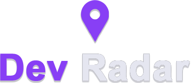
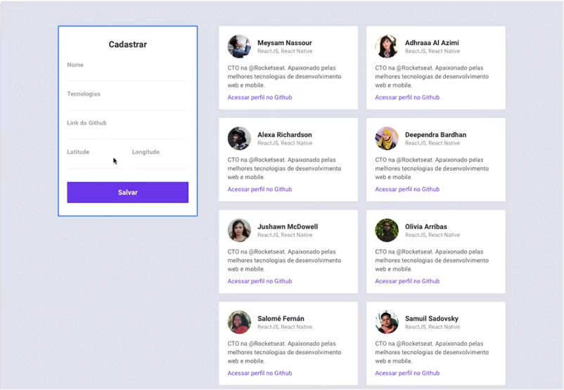
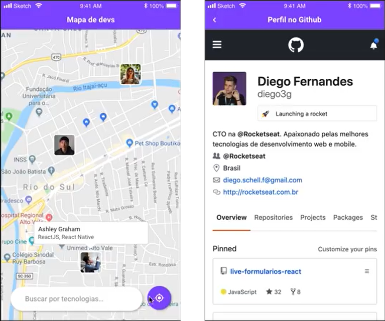

<h1 align="center">
    
</h1>

<h4 align="center"> 
	:heavy_check_mark: 🚀 Semana Omnistack 10 🚀 :heavy_check_mark:
</h4>

  <a href="#-projeto">Projeto</a>&nbsp;&nbsp;&nbsp;|&nbsp;&nbsp;&nbsp;
  <a href="#%EF%B8%8F-demonstração">Demonstração</a>&nbsp;&nbsp;&nbsp;|&nbsp;&nbsp;&nbsp;
  <a href="#-tecnologias">Tecnologias</a>&nbsp;&nbsp;&nbsp;|&nbsp;&nbsp;&nbsp;
  <a href="#%EF%B8%8F-layout">Layout</a>&nbsp;&nbsp;&nbsp;|&nbsp;&nbsp;&nbsp;
  <a href="#memo-licença">Licença</a>

## 🈸 Projeto

DevRadar é um projeto com o objetivo de apresentar no maps, os devs mais próximos com uma ou mais techs iguais.

## 📽️ Demonstração
https://user-images.githubusercontent.com/71707151/181997006-87e04594-126d-41ce-b91e-d61bb93bbc9d.mp4

## 🚀 Tecnologias

O projeto foi desenvolvido utilizando as seguintes tecnologias:

- [Node](https://nodejs.org/pt-br/)
- [React](https://reactjs.org)
- [React Native](https://reactnative.dev)
- [Expo](https://expo.dev)
- [Socket.IO](https://socket.io)
- [MongoDB](https://www.mongodb.com)

## 🖌️ Layout

  
  

## :memo: Licença
Este projeto está sob a licença do MIT. Consulte a [LICENÇA](LICENSE) para obter detalhes.
